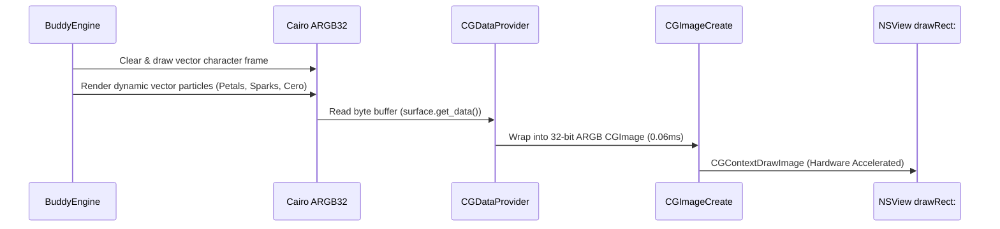
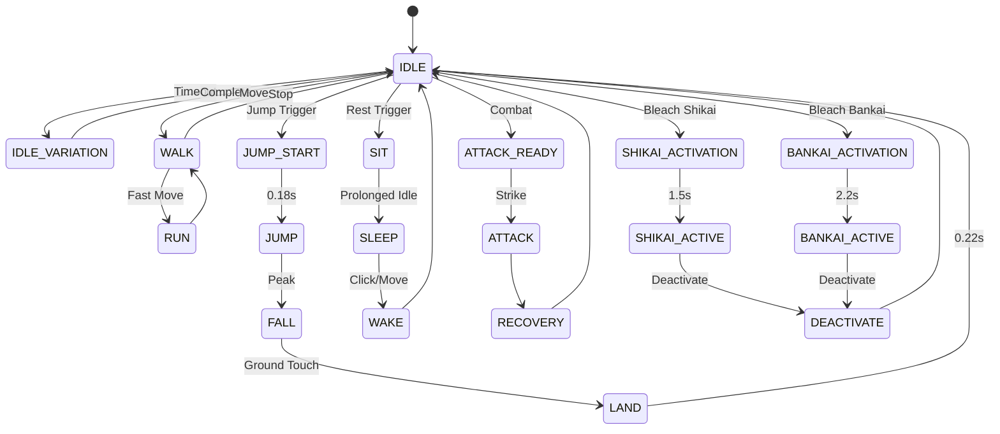

# Buddy 2.0 on macOS — Master Architecture, Character Bible & System Guide

Buddy 2.0 is a production-grade, native desktop companion application engineered specifically for **macOS (Apple Silicon & Intel)** using **AppKit**, **PyObjC**, **Quartz CoreGraphics**, and **Cairo 2D vector rendering**.

This document is the definitive master specification detailing how the macOS version operates, the complete rendering and lifecycle architecture, the 30-state animation state machine, and the full 36-character roster with deep lore and animation profiles for all Bleach characters.

---

## Table of Contents

1. [High-Level macOS Architecture](#1-high-level-macos-architecture)
2. [How Things Function on macOS (Component Breakdown)](#2-how-things-function-on-macos-component-breakdown)
   - [2.1 Application Entry & Lifecycle (`buddy` & `dist/Buddy.app`)](#21-application-entry--lifecycle-buddy--distbuddyapp)
   - [2.2 Desktop Companion Window System (`platforms/macos/window.py`)](#22-desktop-companion-window-system-platformsmacoswindowpy)
   - [2.3 Coordinate System Canonicalization (`platforms/macos/coordinate.py`)](#23-coordinate-system-canonicalization-platformsmacoscoordinatepy)
   - [2.4 Zero-Flicker 60 FPS Retina Cairo Pipeline](#24-zero-flicker-60-fps-retina-cairo-pipeline)
   - [2.5 Circular HitTesting & Ghost Mode (Click-Through)](#25-circular-hittesting--ghost-mode-click-through)
   - [2.6 Quartz Window Perching (`CGWindowListCopyWindowInfo`)](#26-quartz-window-perching-cgwindowlistcopywindowinfo)
   - [2.7 Native Audio Engine (`platforms/macos/audio.py`)](#27-native-audio-engine-platformsmacosaudiopy)
   - [2.8 IPC Socket & Inter-Thread Dispatch](#28-ipc-socket--inter-thread-dispatch)
   - [2.9 User LaunchAgent Autostart](#29-user-launchagent-autostart)
3. [The Buddy Control Center (`platforms/macos/control_center.py`)](#3-the-buddy-control-center-platformsmacoscontrol_centerpy)
   - [3.1 Control Center Architecture & App Reopening](#31-control-center-architecture--app-reopening)
   - [3.2 5 Streamlined Control Panels (Decluttered UI)](#32-5-streamlined-control-panels-decluttered-ui)
   - [3.3 World-Space VFX Architecture: Character Space ≠ Effect Space](#33-world-space-vfx-architecture-character-space--effect-space)
4. [Universal Power Tier Architecture & Schema (`skins/schema.py`)](#4-universal-power-tier-architecture--schema-skinsschemapy)
   - [4.1 Tier Hierarchy: Base, Signature, Power-Up, Ultimate](#41-tier-hierarchy-base-signature-power-up-ultimate)
   - [4.2 Authentic Universe-Specific Labels](#42-authentic-universe-specific-labels)
5. [Composable Ability Engine & Combo System (`core/abilities/`)](#5-composable-ability-engine--combo-system-coreabilities)
   - [5.1 12 Modular Ability Primitives](#51-12-modular-ability-primitives)
   - [5.2 Ability Execution Timeline & Single-Shot Execution](#52-ability-execution-timeline--single-shot-execution)
   - [5.3 Combo Engine & Semantic Tag Compatibility](#53-combo-engine--semantic-tag-compatibility)
   - [5.4 Experimental Cross-Universe Fusion Lab](#54-experimental-cross-universe-fusion-lab)
6. [Hierarchical Behavior Architecture & Companion Brain (`behavior/`)](#6-hierarchical-behavior-architecture--companion-brain-behavior)
   - [6.1 4-Layer Hierarchy: Intent -> Behavior -> Animation -> VFX](#61-4-layer-hierarchy-intent---behavior---animation---vfx)
   - [6.2 Companion Brain & Mood Modifiers](#62-companion-brain--mood-modifiers)
   - [6.3 Autonomous Ability Execution & Smart Suppression](#63-autonomous-ability-execution--smart-suppression)
   - [6.4 Quartz Window Perching Subsystem](#64-quartz-window-perching-subsystem)
7. [User Profiles & Schema Migration (`core/profile.py`)](#7-user-profiles--schema-migration-coreprofilepy)
8. [Performance & Zero-Lag Architecture (Fixing Hanging, Freezing & Glitches)](#8-performance--zero-lag-architecture-fixing-hanging-freezing--glitches)
9. [Standardized 30-State Animation Architecture](#9-standardized-30-state-animation-architecture)
   - [9.1 Unified State Machine (`skins/base.py`)](#91-unified-state-machine-skinsbasepy)
   - [9.2 Deterministic Transition Rules & Expiration](#92-deterministic-transition-rules--expiration)
   - [9.3 Strict Bleach Universe Partitioning (Shikai & Bankai)](#93-strict-bleach-universe-partitioning-shikai--bankai)
10. [Companion Behavior Modes & Interaction System](#10-companion-behavior-modes--interaction-system)
    - [10.1 Companion Modes: Living Desk, Wander, Companion, Chaos](#101-companion-modes-living-desk-wander-companion-chaos)
    - [10.2 Mouse & Keyboard Interactions](#102-mouse--keyboard-interactions)
11. [Character Bible & Complete Roster Information](#11-character-bible--complete-roster-information)
    - [11.1 The 7 Active Bleach Characters (Deep Lore & Rendering Profiles)](#111-the-7-active-bleach-characters-deep-lore--rendering-profiles)
    - [11.2 The 29 Archived Characters (Preserved, Lazy-Loaded & Recoverable)](#112-the-29-archived-characters-preserved-lazy-loaded--recoverable)
12. [Crash Prevention & Defensive Engineering](#12-crash-prevention--defensive-engineering)
13. [Building, Testing & Packaging](#13-building-testing--packaging)

---

## 1. High-Level macOS Architecture

```
┌──────────────────────────────────────────────────────────────────────────────┐
│                            Buddy Engine Core                                 │
│          Physics Loop • Particle Manager • Pomodoro • State Machine          │
└──────────────────────────────────────┬───────────────────────────────────────┘
                                       │
                        ┌──────────────┴──────────────┐
                        ▼                             ▼
             ┌─────────────────────┐       ┌─────────────────────┐
             │    Linux Backend    │       │    macOS Backend    │
             │ (GTK3, GDK, X11/WL) │       │   (AppKit/PyObjC)   │
             └─────────────────────┘       └──────────┬──────────┘
                                                      │
         ┌────────────────────────────────────────────┼────────────────────────────────────────┐
         ▼                                            ▼                                        ▼
┌──────────────────┐                         ┌──────────────────┐                     ┌──────────────────┐
│ BuddyOverlayView │                         │   Buddy Control  │                     │ Native Menu Bar  │
│  NSPanel Overlay │                         │      Center      │                     │  NSStatusItem    │
│  Retina Cairo    │                         │  AppKit 2-Pane   │                     │  SF Symbols Icon │
│  Circular Hitbox │                         │  Live 60fps View │                     │  Quick Actions   │
└────────┬─────────┘                         └────────┬─────────┘                     └──────────────────┘
         │                                            │
         ▼                                            ▼
┌──────────────────┐                         ┌──────────────────┐
│ Quartz Perching  │                         │ 7 Feature Panels │
│ Window Titlebars │                         │ 36-Char Browser  │
│ CGWindowList API │                         │ 30-State Trigger │
└──────────────────┘                         └──────────────────┘
```

The macOS architecture is decoupled from the Linux implementation. It consumes the cross-platform `BaseCharacter`, `ParticleManager`, and `BuddyEngine` simulation primitives and binds them to native Cocoa AppKit windows, views, runloops, and menus.

---

## 2. How Things Function on macOS (Component Breakdown)

### 2.1 Application Entry & Lifecycle (`buddy` & `dist/Buddy.app`)

Buddy can be launched via the CLI command `buddy` or by double-clicking `/Applications/Buddy.app`.

1. **Cold Launch with No Arguments**:
   - Boots `BuddyEngine` on the main AppKit runloop.
   - Instantiates `MacOSBuddyWindow` (the desktop avatar overlay).
   - Mounts `MacOSMenuBar` into the native macOS system status bar with an SF Symbol paw icon (`pawprint.fill`).
   - Automatically opens the **Buddy Control Center** so the user has immediate access to character configuration, appearance, and abilities.
2. **Reopening from Finder / Dock / Spotlight**:
   - `BuddyAppDelegate` implements `applicationShouldHandleReopen:hasVisibleWindows:`.
   - When the user clicks the Buddy application in Finder, Launchpad, or the Dock, macOS notifies the delegate, which automatically presents and brings the Buddy Control Center to the front.
3. **CLI Arguments & Daemon IPC**:
   - `buddy --control-center`: Dispatches an IPC message to open the Control Center.
   - `buddy --skin <name>`: Instantly switches the companion to the requested character.
   - `buddy --mode <static|roam|follow>`: Sets companion behavior mode.
   - `buddy --pomodoro <start|pause|resume|reset|skip>`: Controls productivity focus sessions.
   - `buddy --quit`: Gracefully terminates the running companion.

---

### 2.2 Desktop Companion Window System (`platforms/macos/window.py`)

The companion desktop avatar does not run in a standard titled window. It is implemented using an `NSPanel` subclass (`BuddyNSPanel`):

```python
panel_style = (
    AppKit.NSWindowStyleMaskBorderless |
    AppKit.NSWindowStyleMaskNonactivatingPanel
)
```

Key characteristics:
- **Transparent & Non-Activating**: Does not steal keyboard focus from active macOS apps (Xcode, VS Code, Safari).
- **Window Level**: Configured at `AppKit.NSStatusWindowLevel` so the pet hovers above normal windows while remaining below system modal alerts and Exposé.
- **Space Independence**: Configured with `NSWindowCollectionBehaviorCanJoinAllSpaces | NSWindowCollectionBehaviorFullScreenAuxiliary`, allowing Buddy to seamlessly travel across Mission Control spaces and full-screen applications without disappearing.
- **EngineTimerTarget**: Uses an `NSTimer` added to `NSRunLoop.currentRunLoop()` in `NSRunLoopCommonModes` to pace animation at a consistent 60 FPS (or 30 FPS in low-power mode) independent of display refresh rates.

---

### 2.3 Coordinate System Canonicalization (`platforms/macos/coordinate.py`)

A fundamental divergence between Linux/Cairo and macOS AppKit is the coordinate space:
- **Cairo / Screen Standard**: Origin $(0, 0)$ is at the **top-left**, with $Y$ increasing downwards.
- **AppKit**: Origin $(0, 0)$ is at the **bottom-left**, with $Y$ increasing upwards.

Buddy eliminates coordinate confusion by maintaining world coordinates in standard top-left $Y$-down space and canonicalizing immediately before communicating with AppKit:

$$\text{AppKit } Y = \text{Primary Screen Height} - \text{Buddy } Y$$

$$\text{Buddy } Y = \text{Primary Screen Height} - \text{AppKit } Y$$

Multi-monitor setups query the primary screen bounding rectangle via `AppKit.NSScreen.screens()[0].frame()` to guarantee accurate conversion across auxiliary displays.

---

### 2.4 Zero-Flicker 60 FPS Retina Cairo Pipeline



1. **Backing Scale Factor**: The window queries `NSScreen.backingScaleFactor()`. On Retina Mac displays, this value is `2.0`.
2. **Buffer Allocation**: A 180×180 pt window allocates a 360×360 px `cairo.ImageSurface(cairo.FORMAT_ARGB32, 360, 360)`.
3. **Cairo Matrix Scaling**: The Cairo context is scaled by `ctx.scale(2.0, 2.0)`, ensuring that all vector paths, Bézier curves, hair strokes, and lightning bolts render at native Retina density.
4. **Blitting to AppKit**: In `render_cairo_to_view()`, the raw memory buffer is transformed directly to a `CGImage` via `CGDataProviderCreateWithData` and composited using `CGContextDrawImage`. The entire frame conversion executes in **0.06 ms**, far below the 16.6 ms budget for 60 FPS.

---

### 2.5 Circular HitTesting & Ghost Mode (Click-Through)

Unlike typical transparent desktop apps where the entire rectangular bounding box blocks mouse clicks, Buddy employs **circular hitmasking**:

```python
def hitTest_(self, point):
    if self.click_through:
        return None
    # Calculate distance from window center
    dist = math.hypot(point.x - center_x, point.y - center_y)
    if dist <= self.hitbox_radius:
        return self  # Buddy handles the click/drag
    return None      # Click passes through to macOS app behind Buddy
```

- **Interactive Dragging**: Left-clicking within the 36 pt radius picks up the avatar and repositions it smoothly across the display.
- **Background Pass-Through**: Clicks outside the circle pass directly into background application windows with zero latency.
- **Ghost Mode (`set_click_through(True)`)**: When enabled via the Control Center or Menu Bar, the entire window ignores all mouse events, allowing full interaction with windows directly beneath Buddy.

---

### 2.6 Quartz Window Perching (`CGWindowListCopyWindowInfo`)

When enabled in Free Roam or Desk Pet mode, Buddy reads window geometry through the macOS CoreGraphics Window Server:

```python
window_list = Quartz.CGWindowListCopyWindowInfo(
    Quartz.kCGWindowListOptionOnScreenOnly | Quartz.kCGWindowListExcludeDesktopElements,
    Quartz.kCGNullWindowID
)
```

- **Asynchronous Background Scanning**: Queries are scheduled periodically (12s interval) in a background daemon thread, completely offloading the ~10–95ms WindowServer query latency from the 60 FPS animation loop.
- **Window Scoring & Filtering**: Detects top titlebars, Safari toolbars, terminal headers, and the macOS system menu bar while strictly excluding Buddy, Control Center, Dock, and background layers.
- **Dynamic Ledges**: Companions can dynamically "perch" on top of active application windows, sit down, sleep, or leap between open applications.

---

### 2.7 Native Audio Engine (`platforms/macos/audio.py`)

- **Asynchronous Audio Worker Queue**: Audio requests are pushed non-blockingly (`put_nowait`) to a dedicated background worker thread (`_audio_queue`). File presence checks (`os.path.exists`) and `NSSound` allocations execute off the main thread, guaranteeing zero UI hitching.
- **Channel Priority Hierarchy**: Prioritizes audio playback (`UI` > `ULTIMATE` > `INTERACTION` > `ABILITY` > `AMBIENT`) to ensure high-priority ability cues aren't drowned out by ambient noise.
- **DummyAudio Fallback**: Provides a zero-overhead `DummyAudio` class used during headless testing, mute mode, and inside Control Center preview canvasses to prevent `AttributeError` exceptions.
- **Procedural Waveform Synthesizer**: If an audio file is missing or on fresh installations, Buddy's procedural audio engine dynamically synthesizes clean WAV audio waveforms (swoosh, lightning, fire, magic, laser, smash) in a background thread and caches them in `~/Library/Caches/Buddy/sounds/`.

---

### 2.8 IPC Socket & Inter-Thread Dispatch

- Buddy listens on a local Unix domain socket at `~/.cache/buddy/buddy.sock`.
- Incoming commands are received by a background listener thread and dispatched safely onto the AppKit main runloop using `performSelectorOnMainThread:withObject:waitUntilDone:`, eliminating thread-race conditions when modifying UI state.

---

### 2.9 User LaunchAgent Autostart

- Writes a persistent launch definition to `~/Library/LaunchAgents/com.saurabmishra.buddy.plist`.
- Uses `launchd` with `RunAtLoad = True` to launch Buddy automatically upon user login, without requiring administrative `sudo` privileges.

---

## 3. The Buddy Control Center (`platforms/macos/control_center.py`)

The **Buddy Control Center** is the primary management window for configuring every aspect of the desktop pet.

```
┌────────────────────────────────────────────────────────────────────────────────────────┐
│  Buddy Control Center                                                          _ [ ] X │
├─────────────────┬──────────────────────────────────────────────────────────────────────┤
│  Buddy 2.0      │  ┌────────────────────────────────────────────────────────────────┐  │
│  Version 2.0.0  │  │ [Live 60fps Cairo Canvas]  Ichigo Kurosaki         (Bleach)    │  │
│                 │  │   (Shows animation/vfx)   Substitute Soul Reaper               │  │
│  ─────────────  │  │                           State: IDLE                          │  │
│  Overview       │  │                           [ Switch to This Companion ]         │  │
│  Characters     │  └────────────────────────────────────────────────────────────────┘  │
│  Animations     │                                                                      │
│  Abilities      │  [ Overview | Characters | Animations | Abilities | Appearance ... ] │
│  Appearance     │  ──────────────────────────────────────────────────────────────────  │
│  Behavior       │  (Tab-specific interactive controls, sliders, buttons, grids)        │
│  Settings       │                                                                      │
└─────────────────┴──────────────────────────────────────────────────────────────────────┘
```

### 3.1 Control Center Architecture & App Reopening
- Subclasses `AppKit.NSWindow` with `NSWindowStyleMaskTitled | NSWindowStyleMaskClosable | NSWindowStyleMaskMiniaturizable`.
- Uses `objc.super` for reliable initialization.
- Window level is set to `NSFloatingWindowLevel` so it floats above normal application windows when active.
- Managed by a global singleton instance: calling `show_macos_control_center(engine)` reveals the window and calls `AppKit.NSApplication.sharedApplication().activateIgnoringOtherApps_(True)`.

### 3.2 5 Streamlined Panels (Decluttered UI)

1. **Home**:
   - Character hero preview with high-DPI Retina Cairo preview, role badge, and description.
   - **Live Companion Status & Mood**: Displays active companion, current mood, and activity (e.g. *Living Desk: Observing desktop*).
   - **Primary Actions**: 4 responsive action buttons:
     - **Play**: Triggers character-specific playful animations (e.g. phone check for Ichigo, scarf adjustment for Byakuya, beard stroke for Yamamoto, Chappy doodle for Rukia).
     - **Signature**: Fires signature moves with unclipped world VFX (Getsuga Tenshō, Senbonzakura, Flame Wave, etc.).
     - **Power-Up**: Shikai aura release / battle stance.
     - **Ultimate**: Bankai / Segunda Etapa transformation.
2. **Characters**:
   - Strictly exposes the **7 active Bleach characters**: Ichigo, Byakuya, Yamamoto, Tōshirō Hitsugaya, Rukia, Aizen, and Ulquiorra.
   - All 29 other characters remain archived and are loaded on-demand only if requested.
   - Instant click-to-switch with zero lag.
3. **Behavior**:
   - Simple 4-mode selector:
     - **Living Desk (Default)**: Rests on your desk, naturally looking around and surprising you with occasional signature abilities.
     - **Wander**: Freely roams monitors, window headers, and platforms.
     - **Companion**: Follows cursor across active windows.
     - **Chaos**: High-energy playground mode with frequent power flourishes.
   - Window Perching controls (`Safe`, `Free`, `Off`).
4. **Settings**:
   - **Sound**: Toggle sound effects & volume control.
   - **Autonomous Abilities**: Simple 4-mode frequency selector (`OFF`, `OCCASIONAL`, `ACTIVE`, `CHAOS`).
   - **Focus Mode (Pomodoro)**: 25m work / 5m break countdown timer with Start, Pause, and Reset.
   - **Performance**: Low Power / Battery Saver mode toggle.
   - **Launch at Login**: Start Buddy automatically at macOS login (`MacOSAutostart`).
5. **Developer Mode**:
   - Houses advanced telemetry: FPS, frame delta, world coordinates, Cairo stride, quartz window scan, active particle count.
   - Manual 30-State Animation Triggers (all `CharacterState` enum values).
   - **Archived Character Browser**: On-demand testing of the 29 archived non-Bleach characters without bloating the main roster.
   - Factory defaults reset button.

---

### 3.3 World-Space VFX Architecture: Character Space ≠ Effect Space (`platforms/macos/window.py`)

A foundational rendering principle in Buddy 2.0 is that **the character itself can be small, while its ability can occupy a massive visual footprint across the macOS desktop**.

Under no circumstances are abilities clipped to the character's local canvas or window bounding box. To achieve this without ballooning the character's window or blocking mouse clicks, the engine establishes **three separate conceptual bounds**:

1. **Character Bounds ($\approx 180\times 180\text{ pt}$)**:
   - Houses the character's body silhouette, clothing, facial expressions, micro-animations, and immediate idle auras.
   - Kept compact to conserve memory and render buffers.
2. **Interaction Bounds ($54\text{ pt circular radius}$)**:
   - The active mouse hit-testing mask.
   - Any click outside this 54pt circle immediately passes through to the underlying macOS windows, Xcode editor, terminal, or browser.
3. **VFX / Effect Bounds ($500\text{ to } 1800+\text{ pt}$)**:
   - A dedicated, decoupled world-space canvas rendered via `MacOSWorldEffectWindow`.
   - Positions dynamically in screen coordinates relative to the character's global position and trajectory.
   - Attacks travel naturally outward across the display (e.g. across multiple monitors or windows) rather than staying trapped inside an avatar box.
   - Uses `setIgnoresMouseEvents_(True)` so it never intercepts user mouse clicks, drags, or gestures.

```
┌──────────────────────────────────────────────────────────────────────────────────┐
│ macOS Screen World Space (VFX Bounds: 500 - 1800+ px)                            │
│                                                                                  │
│   ┌──────────────────────────┐                                                   │
│   │ Character Bounds         │                                                   │
│   │ (~180 px Window)         │       ═════════════════════════════════════►      │
│   │    ┌──────────────┐      │            Unclipped Travelling VFX               │
│   │    │ Interaction  │      │     (Getsuga Tenshō / Cero / Flame Wave)         │
│   │    │ Bounds       │      │                                                   │
│   │    │ (54px Hitbox)│      │                                                   │
│   │    └──────────────┘      │                                                   │
│   └──────────────────────────┘                                                   │
│                                                                                  │
└──────────────────────────────────────────────────────────────────────────────────┘
```

#### World VFX Architecture:
- Reference architecture derived from Thor's screen-spanning lightning storms and generalized to all characters through `MacOSWorldEffectWindow`.
- Built on top of high-DPI Retina Cairo vector surfaces composited via hardware-accelerated `CGContextDrawImage`.
- Procedural particle pooling and cached geometry ensure that massive visual footprints run at a steady 60 FPS without spiking CPU or memory.
- The window automatically invalidates its timer, releases its Cairo surface, and orders out upon animation completion (~0.7s to 1.2s), ensuring 0% idle CPU and zero memory leak.

#### Supported World VFX Abilities:
- **Getsuga Tenshō (Ichigo)**: 600–1000px travelling crescent energy wave in electric cyan (Shikai) or obsidian black with crimson flame (Bankai).
- **Senbonzakura Kageyoshi (Byakuya)**: Twin giant rising katana pillars with an 800px swirling pooled cherry blossom petal vortex.
- **Ryūjin Jakka (Yamamoto)**: 900px sweeping inferno wave with rolling smoke and burning embers.
- **Hyōrinmaru (Hitsugaya)**: Soaring 800px crystalline ice dragon with hexagonal scales and freezing mist trail.
- **Tsukishiro (Rukia)**: Sub-zero frost mandala circle (400px) expanding into a towering pure white light pillar.
- **Kyōka Suigetsu (Aizen)**: 600px shattered reality mirror fracture web with duplicate illusion positioning.
- **Hadō #90: Kurohitsugi (Aizen)**: Towering obsidian gravity coffin sealed by purple Reiatsu spears.
- **Cero Oscuras (Ulquiorra)**: 1000px pitch-black void beam bordered by a roaring emerald spiritual corona.
- **Lanza del Relámpago (Ulquiorra)**: Emerald lightning javelin detonating into a gigantic energy cross.

---

## 4. Universal Power Tier Architecture & Schema (`skins/schema.py`)

To eliminate hardcoded Bleach terminology from non-Bleach characters (such as pets or superheroes displaying "Bankai"), Buddy 2.0 introduces a **Universal Power Tier Hierarchy**:

### 4.1 Tier Hierarchy: Base, Signature, Power-Up, Ultimate
1. **BASE**: Default character state and standard resting posture.
2. **SIGNATURE**: Primary identity action (e.g. Thor Mjolnir throw, Ichigo Getsuga, Spider-Man Web Swing, Cat Curious Pounce).
3. **POWER_UP**: Elevated state or secondary release (e.g. Ichigo Shikai, Thor Lightning Surge, Hulk Rage, Cat Zoomies).
4. **ULTIMATE**: Peak universe transformation (e.g. Ichigo Bankai, Thor God Blast, Iron Man Proton Cannon, Cat Midnight Chaos).

### 4.2 Authentic Universe-Specific Labels
Every character registers custom tier labels via `skins/schema.py`:
- **Ichigo**: *Base* -> *Getsuga Tenshō* -> *Shikai Release* -> *Bankai: Tensa Zangetsu*
- **Byakuya**: *Base* -> *Senka* -> *Shikai: Chire* -> *Bankai: Senbonzakura Kageyoshi*
- **Thor**: *Base* -> *Mjolnir Strike* -> *Lightning Aura* -> *God Blast*
- **Spider-Man**: *Base* -> *Web Swing* -> *Spider-Sense* -> *Maximum Web*
- **Cat**: *Base* -> *Curious Pounce* -> *Zoomies* -> *Midnight Chaos*

---

## 5. Composable Ability Engine & Combo System (`core/abilities/`)

### 5.1 12 Modular Ability Primitives
Abilities are composed from 12 reusable primitives in [`core/abilities/primitives.py`](file:///Users/tshrayansh/buddy%20for%20mac%20/core/abilities/primitives.py):
1. `MovementPrimitive`: Eased translation, lunges, and cursor homing.
2. `ChargePrimitive`: Energy gathering with throttled collapsing particle halos.
3. `ProjectilePrimitive`: Flying crescent slashes, batarangs, and web balls with throttled trails.
4. `BeamPrimitive`: Sustained lasers, Ceros, and unibeams with dynamic width curves.
5. `MeleePrimitive`: Arc slashes, claw swipes, and shield bashes.
6. `AreaEffectPrimitive`: Ground slams, petal storms, and shockwaves.
7. `ShieldPrimitive`: Hexagonal forcefields and barrier pulses.
8. `TeleportPrimitive`: Shunpo flash steps and smoke disappearances with opacity fades.
9. `TransformationPrimitive`: Aura surges, screen shake, and form morphing.
10. `ParticlePrimitive`: Single-shot burst emissions of arbitrary particle families.
11. `SoundPrimitive`: Non-blocking queued audio triggers.
12. `RecoveryPrimitive`: Smooth momentum settling and VFX dissipation.

### 5.2 Ability Execution Timeline & Single-Shot Execution
- Managed by `AbilityRunner`: Primitive execution progress is calculated from accumulated timelines.
- Finished primitives execute at `progress=1.0` exactly once and are marked `completed = True`, preventing runaway loop execution.
- Every primitive implements `reset()` to ensure stateless reuse across executions.

### 5.3 Combo Engine & Semantic Tag Compatibility
- [`core/abilities/combo.py`](file:///Users/tshrayansh/buddy%20for%20mac%20/core/abilities/combo.py) maintains a transition graph between semantic tags (`movement` -> `melee` -> `projectile` -> `finisher`).
- Builds coherent combo sequences autonomously or on key combos.

### 5.4 Experimental Cross-Universe Fusion Lab
- [`core/abilities/fusion.py`](file:///Users/tshrayansh/buddy%20for%20mac%20/core/abilities/fusion.py) synthesizes cross-character techniques (e.g. *Lightning Shunpo*, *Repulsor Web Dash*, *Frozen Senbonzakura*). Disabled by default for canon purity.

---

## 6. Hierarchical Behavior Architecture & Companion Brain (`behavior/`)

### 6.1 4-Layer Hierarchy: Intent -> Behavior -> Animation -> VFX
Buddy structures companion behavior across four distinct layers:
- **Layer 1: Intent**: High-level motivation (`idle`, `explore`, `follow`, `rest`, `react`, `play`, `celebrate`, `sleep`).
- **Layer 2: Character Behavior**: Unique persona manifestations (e.g., Ichigo blade adjustment; Cat ear twitch).
- **Layer 3: Animation State**: Canonical 30-state transitions.
- **Layer 4: VFX & Audio**: Secondary particle emitters, sound cues, and screen shake.

### 6.2 Companion Brain & Mood Modifiers
- [`behavior/brain.py`](file:///Users/tshrayansh/buddy%20for%20mac%20/behavior/brain.py) drives contextual decision-making.
- [`behavior/mood.py`](file:///Users/tshrayansh/buddy%20for%20mac%20/behavior/mood.py) modulates movement frequency, speed, reaction probability, and VFX intensity based on moods (`CALM`, `HAPPY`, `CURIOUS`, `EXCITED`, `FOCUSED`, `SLEEPY`, `ANNOYED`).

### 6.3 Autonomous Ability Execution & Living Desk Mode
- [`behavior/autonomous.py`](file:///Users/tshrayansh/buddy%20for%20mac%20/behavior/autonomous.py) enables companions to perform signature abilities periodically without user intervention.
- **Simplified 4-Tier Control**:
  - `OFF`: Completely disables autonomous abilities (strictly manual triggers).
  - `OCCASIONAL` (**Default**): Fires a signature flourish once every 60–180 seconds. Ideal for daily desktop work.
  - `ACTIVE`: Fires abilities every 30–60 seconds during active engagement.
  - `CHAOS`: High-frequency sandbox mode firing power flourishes every 10–25 seconds.
- **Living Desk Philosophy**:
  - Default behavior on macOS.
  - The character naturally idles, checks surroundings, breathes, walks smoothly, and occasionally surprises the user with a signature ability without requiring configuration or spamming the screen.
- **Intelligent Selection Matrix**:
  - Selection weighs: Character Personality + State Cooldown + Recent Actions (no repetition) + Desktop Context + Weighted Rarity.
- **Smart Anti-Annoyance Suppression**:
  - Automatically suppresses abilities when rapid user typing or mouse movement is detected, when the user is in Focus Mode (Pomodoro), or when low-power mode is enabled.

### 6.4 Quartz Window Perching Subsystem
- [`behavior/perching.py`](file:///Users/tshrayansh/buddy%20for%20mac%20/behavior/perching.py) scores candidate windows based on dimensions, proximity, and titlebar visibility.
- Modes: `OFF` (floor only), `SAFE` (occasional window rest), `FREE` (active multi-window leaping).

---

## 7. User Profiles & Schema Migration (`core/profile.py`)

- Manages configuration profiles (`Default`, `Focus Mode`, `Gaming Mode`, `Anime Chaos`, `Minimal`).
- Supports JSON import/export and provides automatic `schema_version: 2` migration for backwards compatibility.

---

## 8. Performance & Zero-Lag Architecture (Fixing Freezing, Hangs & Glitches)

To guarantee a locked 60 FPS on macOS with zero frame hitching or freezing, Buddy 2.0 incorporates the following low-level optimizations:

1. **Elimination of Control Center Preview Timer Leak**:
   - In `BuddyControlCenterWindow`, an `NSTimer` running at 30 FPS updates the preview canvas. Previously, without `self.setDelegate_(self)`, AppKit never invoked `windowWillClose:`, allowing the timer to tick forever in the background and compete with the desktop engine.
   - Fixed by explicitly binding the delegate, invalidating and releasing the timer on window close, and pausing preview rendering whenever the window is not visible.
2. **Throttled Ability Primitives & Single-Shot Execution**:
   - `ParticlePrimitive`, `AreaEffectPrimitive`, and `TransformationPrimitive` emit particles **once** on activation rather than every frame.
   - Inward charge particles and projectile trails are throttled to at most once per 80–100ms.
   - `AbilityRunner` marks finished primitives completed so they are never redundantly re-run at `progress=1.0`.
3. **Defensive Particle Unpacking**:
   - Engine pops `"type"`, `"x"`, and `"y"` before forwarding kwargs to `spawn_generic`, eliminating `TypeError: multiple values for argument 'x'` crashes.
4. **Asynchronous Audio Pipeline**:
   - All sound disk checks and `NSSound` allocations execute inside a dedicated background worker queue, completely freeing the main AppKit thread.
5. **Startup Memory Optimization via Lazy Loading**:
   - Roster startup imports only the **7 Active Bleach Characters** (`ichigo`, `byakuya`, `yamamoto`, `hitsugaya`, `rukia`, `aizen`, `ulquiorra`).
   - The remaining 29 archived skins are loaded strictly on-demand, reducing cold boot memory footprint and eliminating startup module churn.
6. **Asynchronous WindowServer Queries**:
   - Quartz `CGWindowListCopyWindowInfo` queries run in background daemon threads on 12-second intervals, eliminating the 10–95ms frame drop.
7. **Zero-Allocation Particle Count**:
   - `ParticleManager.particle_count` sums list lengths directly, eliminating the creation of 12 temporary intermediate lists on every frame.
8. **Instant Character Switching UX**:
   - Control Center character card selection triggers immediate skin switching on the desktop.

---

## 9. Standardized 30-State Animation Architecture

Every character in Buddy obeys the unified state machine defined in [`skins/base.py`](file:///Users/tshrayansh/buddy%20for%20mac%20/skins/base.py).



### 4.1 Unified State Machine (`skins/base.py`)

- Managed by `CharacterStateMachine` attached to `character.state_machine`.
- Provides `@property def state` and `@state.setter def state(val)` on `BaseCharacter` for full backwards compatibility with legacy code.

### 4.2 Deterministic Transition Rules & Expiration

Temporary action states define standard durations and deterministic next states:

| State | Default Duration | Next State | Description |
| :--- | :--- | :--- | :--- |
| `JUMP_START` | 0.18s | `JUMP` | Anticipation compression before takeoff |
| `JUMP` | 0.45s | `FALL` | Ascending airborne phase |
| `FALL` | 0.35s | `LAND` | Descending airborne phase |
| `LAND` | 0.22s | `IDLE` | Landing impact compression and recovery |
| `ATTACK_READY` | 0.40s | `ATTACK` | Stance winding / weapon pullback |
| `ATTACK` | 0.65s | `RECOVERY` | Weapon strike / projectile launch |
| `RECOVERY` | 0.50s | `IDLE` | Return to guard stance |
| `SHIKAI_ACTIVATION` | 1.50s | `SHIKAI_ACTIVE` | Spiritual pressure expansion & transformation |
| `BANKAI_ACTIVATION` | 2.20s | `BANKAI_ACTIVE` | Dramatic Bankai burst & form alteration |
| `DEACTIVATE` | 0.80s | `IDLE` | Form release and return to normal |
| `RETURN_TO_IDLE` | 0.25s | `IDLE` | Immediate smooth reset to idle |

### 9.3 Strict Bleach Universe Partitioning (Shikai & Bankai)

Shikai and Bankai transformations are **strictly reserved for characters in `BLEACH_CHARACTERS`**:

```python
BLEACH_CHARACTERS = {
    "ichigo", "byakuya", "yamamoto", "kenpachi", "hitsugaya", "rukia", "urahara",
    "aizen", "yoruichi", "shunsui", "soi_fon", "shinji", "mayuri", "ulquiorra"
}
```

- When `transition_to(CharacterState.SHIKAI_ACTIVATION)` is called on a Bleach character, they enter their Shikai form.
- When `transition_to(CharacterState.SHIKAI_ACTIVATION)` is called on a non-Bleach character (e.g. Thor, Spider-Man, Cat), the state machine automatically intercepts the call and maps it to `SPECIAL_READY` (their superhero/signature move).
- When `transition_to(CharacterState.BANKAI_ACTIVATION)` is called on a non-Bleach character, the state machine automatically maps it to `ULTIMATE`.

---

## 10. Companion Behavior Modes & Interaction System

### 10.1 Companion Modes: Living Desk, Wander, Companion, Chaos

1. **Living Desk Mode (Default)**:
   - Buddy rests on your desk space, wallpaper, or open window ledge.
   - Does not chase the cursor or sprint across open windows.
   - Performs pleasant, natural micro-animations (blinking, breathing, looking around, stretching, sleeping, phone checks, glasses adjustments).
   - Occasionally surprises the user with a signature power flourish without requiring constant configuration or spamming the screen.
2. **Wander Mode**:
   - Buddy explores the desktop autonomously.
   - Walks across open wallpaper areas, climbs onto active application window titlebars, perches on Safari or Terminal edges, and occasionally sits down.
3. **Companion Mode**:
   - Buddy follows the mouse pointer using a smart **hysteresis deadzone**:
     - Within 90 pt: Buddy sits or idles calmly near your mouse without fidgeting.
     - Beyond 160 pt: Buddy stands up and walks/runs smoothly toward the cursor.
4. **Chaos Mode**:
   - High-energy desktop playground where Buddy moves quickly, leaps dynamically, and triggers high-frequency power flourishes.

### 10.2 Mouse & Keyboard Interactions

| Input Gesture | Action Performed |
| :--- | :--- |
| **Left Click & Drag** | Pick up Buddy, suspend gravity, and move anywhere on your screen. |
| **Double Click** | **Opens the Buddy Control Center** immediately. |
| **Right Click** | Opens native macOS popup context menu with quick options. |
| **Scroll Wheel** | Cycles to the next character skin in the library. |
| **Cmd+,** | Global keyboard shortcut to open the Buddy Control Center. |
| **Option + Click** | Transparent pass-through click to underlying desktop application. |

---

## 11. Character Bible & Roster Architecture

Buddy's roster is partitioned into two distinct operational tiers:
1. **The 7 Active Bleach Characters**: The primary roster exposed in the Control Center, menu bar, and companion switcher. Default companion on macOS is **Ichigo**.
2. **The 29 Archived Characters**: All other characters (7 secondary Bleach characters, 8 Superheroes, 4 Pets, and 10 Fantasy/Sci-Fi/Cute companions) remain **100% intact, preserved, and recoverable**. Their code and rendering logic are never deleted. They are lazy-loaded on demand (costing 0 MB RAM at boot) and can be previewed or activated anytime via Developer Mode or automated test suites.

---

### 11.1 The 7 Active Bleach Characters (Deep Lore & Rendering Profiles)

Each of the 7 active characters is visually distinct even during idle rest, with customized rendering pipelines, authentic lore-accurate Zanpakutō sequences, and unclipped world-space VFX:

---

#### 1. Ichigo Kurosaki (`ichigo`)
- **Series & Role**: Bleach — Substitute Soul Reaper
- **Visual Identity & Rendering**:
  - Strong, athletic silhouette with spiky orange hair and brown eyes.
  - Black Shihakushō with broad, oversized Zangetsu blade carried diagonally across back.
  - Electric cyan/blue Reiatsu aura during base and Shikai forms; dramatic shift to deep crimson and obsidian black in Bankai.
  - Locomotion features high-speed Shunpo dashes leaving crisp trailing afterimages.
- **Idle Nuances**: Confident resting stance, blade adjustment, checking pocket phone, occasional arms-crossed observation.
- **Abilities & World VFX**:
  - **Play**: Pocket phone check & blade readjustment with upbeat spirit motes.
  - **Signature**: **Getsuga Tenshō** — Sweeping crescent wave of blue spiritual energy.
  - **Power-Up**: **Shikai Aura Expansion** — Grips Zangetsu hilt, bursting an electric cyan spiritual pressure aura.
  - **Ultimate & World VFX**: **Bankai: Tensa Zangetsu & Crimson Getsuga** — Compresses Reiatsu, manifesting slender black daitō and long coat with red lining. Fires an **unclipped 800–1000px travelling crimson-black crescent wave** that surges across the desktop.

---

#### 2. Byakuya Kuchiki (`byakuya`)
- **Series & Role**: Bleach — Captain of the 6th Division, Head of the Kuchiki Clan
- **Visual Identity & Rendering**:
  - Aristocratic, composed posture with minimal superfluous motion.
  - Long black hair secured by pristine white Kenseikan clips, teal Ginpakukenshin scarf, and flowing Captain's white Haori.
  - Thousands of individually moving, procedural pooled pink cherry blossom petal particles (`Senbonzakura`).
  - Strong circular compositions with petal depth, rotation, and orbit physics.
- **Idle Nuances**: Composed stillness, dignified scarf adjustment, quiet meditation.
- **Abilities & World VFX**:
  - **Play**: Aristocratic posture check and scarf fold.
  - **Signature**: **Senbonzakura Blade Drop** — Releases Zanpakutō vertically downward into the desktop surface.
  - **Power-Up**: **Expanding Petal Storm** — Thousands of pooled cherry blossom blade petals orbiting Byakuya in layered concentric rings.
  - **Ultimate & World VFX**: **Senbonzakura Kageyoshi & Shūkei Hakuteiken** — Giant katana pillars emerge from floor reflections, erupting into an **unclipped 800px swirling cherry blossom vortex**, followed by pure white glowing spirit wings and concentrated finishing thrust.

---

#### 3. Genryūsai Shigekuni Yamamoto (`yamamoto`)
- **Series & Role**: Bleach — Captain-Commander of the Gotei 13
- **Visual Identity & Rendering**:
  - Heavy, deliberate, ancient warrior posture conveying immense gravitational presence.
  - Cascading white beard tied with purple ribbon, crisscrossing battle scars across head and torso, wooden walking cane concealing Zanpakutō.
  - Fiery orange and deep red lighting with procedural heat distortion, smoke ribbons, and floating ember particles.
  - Large, sweeping flame silhouettes that occupy substantially more space than Yamamoto himself without being clipped by the character bounds.
- **Idle Nuances**: Stroking cascading beard, leaning on cane, deep meditative stillness.
- **Abilities & World VFX**:
  - **Play**: Dignified beard stroke and cane tap.
  - **Signature**: **Concentrated Flame Burst** — Heavy cane strike erupting with fiery shockwaves.
  - **Power-Up**: **Ryūjin Jakka Ignition** — Cane dissolves, revealing blazing blade and towering inferno aura.
  - **Ultimate & World VFX**: **Zanka no Tachi** — Scorching blackened heat wave. Dispatches an **unclipped 900px sweeping fire wave** across the screen accompanied by ash desaturation and smoke particles.

---

#### 4. Tōshirō Hitsugaya (`hitsugaya`)
- **Series & Role**: Bleach — Captain of the 10th Division
- **Visual Identity & Rendering**:
  - Crisp white and icy turquoise palette with crystalline vector geometry.
  - Spiky white hair, turquoise eyes, green sash across chest, compact katana.
  - Frost accumulation and gentle snowfall particles.
  - Avoids expensive brute-force particle spam by utilizing reusable crystalline polygon paths and diamond geometry.
- **Idle Nuances**: Arms folded across chest, scanning surroundings with intense focus, visible frost breath.
- **Abilities & World VFX**:
  - **Play**: Arms folded stance & frost mist breath.
  - **Signature**: **Ice Trail Dash** — Swift lunge leaving a crystalline frost trail along the surface.
  - **Power-Up**: **Hyōrinmaru Crystalline Wings** — Spans large crystalline ice wings and floating ice flowers from his back.
  - **Ultimate & World VFX**: **Daiguren Hyōrinmaru** — Summons a **colossal 800px soaring crystalline ice dragon** with hexagonal scales that surges across desktop windows.

---

#### 5. Rukia Kuchiki (`rukia`)
- **Series & Role**: Bleach — Captain of the 13th Division
- **Visual Identity & Rendering**:
  - Petite, elegant, and minimal movement with high-contrast composition.
  - Jet-black hair with a single strand falling between violet eyes; pure white Zanpakutō with an elongated trailing white ribbon.
  - Pale frost aura, clean white/blue color contrast, and delicate snowflake particles.
- **Idle Nuances**: Graceful stance, drawing rabbit doodle (Chappy) in the air, watching snowfall.
- **Abilities & World VFX**:
  - **Play**: Draws glowing Chappy rabbit doodle in the air with spirit particles.
  - **Signature**: **Some no Mai: Tsukishiro** — Traces a circle with Sode no Shirayuki, freezing the ground surface.
  - **Power-Up**: **Sub-Zero Frost Aura** — Expands an icy mandala circle of sub-zero mist.
  - **Ultimate & World VFX**: **Hakka no Togame** — Flowing translucent white robes and crystalline hairpin. Spawns an **unclipped towering white light pillar** accompanied by absolute-zero freeze lines.

---

#### 6. Sōsuke Aizen (`aizen`)
- **Series & Role**: Bleach — Former 5th Division Captain, Lord of Las Noches
- **Visual Identity & Rendering**:
  - Extremely controlled, subtle movement with composed breathing cycles.
  - Swept-back dark brown hair with single curved fringe, serene smirk, white Hueco Mundo haori, Kyōka Suigetsu sheathed at hip.
  - Dark violet spiritual aura and psychological illusion effects.
  - Leverages compositing, opacity blending, sprite duplication, and coordinate distortion rather than brute-force particle spam.
- **Idle Nuances**: Perfectly still breathing, adjusting glasses with single finger, tranquil condescending smile.
- **Abilities & World VFX**:
  - **Play**: Characteristic glasses adjustment with purple spirit glint.
  - **Signature**: **Kyōka Suigetsu (Kanzen Saimin)** — Spatial distortion with duplicate illusion avatars appearing across the screen.
  - **Power-Up**: **Hypnotic Reality Shatter** — 600px fractured mirror glass lines spreading across open space.
  - **Ultimate & World VFX**: **Hadō #90: Kurohitsugi** — Spawns an **unclipped towering obsidian black gravity coffin** sealed by purple Reiatsu spears, collapsing in on itself.

---

#### 7. Ulquiorra Cifer (`ulquiorra`)
- **Series & Role**: Bleach — 4th Espada
- **Visual Identity & Rendering**:
  - Dark, high-contrast silhouette with pale alabaster skin and dark green tear-track facial markings.
  - Horned hollow helmet fragment, deep emerald eyes, white Arrancar coat.
  - Aerial and floating locomotion dynamics; massive leathery bat wings expanding far beyond normal character bounds.
- **Idle Nuances**: Hands tucked into coat pockets, motionless stoic stare, dark green Reiatsu flicker.
- **Abilities & World VFX**:
  - **Play**: Hands in pockets with cold, impassive gaze.
  - **Signature**: **Murciélago Aerial Dash** — Sweeps forward on massive black bat wings.
  - **Power-Up**: **Segunda Etapa Transformation** — Silhouette expansion with long demonic tail, black clawed wings, and emerald lightning.
  - **Ultimate & World VFX**: **Cero Oscuras & Lanza del Relámpago** — Unleashes a **colossal 1000px pitch-black void energy beam** with a roaring emerald corona, followed by an emerald lightning javelin that detonates into a screen-spanning cross.

---

### 11.2 The 29 Archived Characters (Preserved, Lazy-Loaded & Recoverable)

All 29 non-primary companions remain **completely implemented and preserved** in the codebase. To optimize startup performance, their modules are not imported at boot, saving memory and eliminating launch lag. They can be inspected, tested, and activated on demand in Developer Mode or via automated tests:

1. **Archived Bleach Characters (7)**:
   - **Kenpachi Zaraki (`kenpachi`)**: Muscular cleaver warrior with Nozarashi shockwave and red demonic rage.
   - **Kisuke Urahara (`urahara`)**: Hat-and-clogs eccentric with Benihime shield, crimson slashes, and Kannonbiraki restructuring.
   - **Yoruichi Shihōin (`yoruichi`)**: Flash Goddess with cat-like agility and Shunkō lightning mantle.
   - **Shunsui Kyōraku (`shunsui`)**: Floral haori swordsman with Kageoni shadow dive and Karamatsu Shinjū dark stage.
   - **Soi Fon (`soi_fon`)**: Stealth Force commander with Suzumebachi stinger gauntlet and Jakuhō Raikōben artillery.
   - **Shinji Hirako (`shinji`)**: Cheeky Visored leader with Sakanade inverted mist and Hollow mask.
   - **Mayuri Kurotsuchi (`mayuri`)**: Flamboyant SRDI mad scientist with Ashisogi Jizō poison mist and golden caterpillar Bankai.

2. **Superheroes Universe (8 Characters)**:
   - **Thor (`thor`)**: Mjolnir hammer toss and lightning screen strikes.
   - **Spider-Man (`spiderman`)**: Acrobatic web swinging, web projectiles, and spider-sense dodges.
   - **Iron Man (`ironman`)**: Repulsor blasts, flight thrusters, and supersonic dashes.
   - **Hulk (`hulk`)**: Ground-shattering Hulk Smash, leap physics, and roaring shockwaves.
   - **Captain America (`captain_america`)**: Vibranium shield throw and ricochet physics.
   - **Thanos (`thanos`)**: Infinity Gauntlet space teleportation, reality distortion, and the Snap.
   - **Batman (`batman`)**: Batarangs, grapple line swings, and rooftop perching.
   - **Superman (`superman`)**: Supersonic flight, red heat vision beams, and invulnerable posture.

3. **Pets & Animals (4 Companions)**:
   - **Cat (`cat`)**: Pounces, tail swishes, paw grooming, purring, and yarn chasing.
   - **Dog (`dog`)**: Tail wags, playful barking, digging, and click fetching.
   - **Penguin (`penguin`)**: Waddling, belly-sliding, and snow hopping.
   - **Fox (`fox`)**: Bushy tail sprints, curious sniffing, and acrobatic leaps.

4. **Fantasy, Sci-Fi & Cute (10 Companions)**:
   - **Dragon (`dragon`)**: Roaring fire streams, fireballs, and flight gliding.
   - **Pixel Wizard (`pixel_wizard`)**: Arcane spell circles, teleportation, and magic orbs.
   - **Space Robot (`space_robot`)**: Jet thrusters, diagnostic scanners, and holographic displays.
   - **Ninja (`ninja`)**: Smoke bomb escapes, shuriken stars, and wall leaps.
   - **Vampire (`vampire`)**: Cloak levitation and fluttering bat swarms.
   - **Fairy (`fairy`)**: Iridescent sparkling star dust and healing radiance.
   - **Alien (`alien`)**: UFO tractor beams and anti-gravity bubbles.
   - **Ghost (`ghost`)**: Window phasing and eerie floating spirit motes.
   - **Slime (`slime`)**: Bouncy squash-and-stretch jelly dynamics.
   - **Harry Potter (`harry_potter`)**: Lumos, Expelliarmus, and broomstick flights.

---

## 12. Crash Prevention & Defensive Engineering

To ensure Buddy stays open for hours or days without crashing, multiple defensive layers were implemented:

1. **Objective-C Runloop Boundaries**:
   All AppKit timer ticks (`EngineTimerTarget.onTick_`) and event handlers are enclosed in `try/except` blocks. If an unexpected error occurs during a tick, it is logged and the character's state machine safely resets to `IDLE` instead of terminating the process.
2. **Atomic Character Switching**:
   Switching skins (`BuddyEngine.switch_skin()`) performs metadata verification and instantiation in an isolated sandbox. If an invalid skin or missing asset is encountered, the engine logs a warning and maintains the current character or safely falls back to `ichigo` on macOS (`thor` on Linux).
3. **Universal Audio Fallback**:
   Every character ability handler verifies `if audio_mgr:` before calling `.play()`, or falls back automatically to `core.audio.audio_manager`. Running in mute mode or on machines without audio devices will never cause an exception.
4. **Bounded Particle Systems**:
   All particle buffers (`ParticleManager`) are capped (300 in live mode, 150 in preview) using FIFO recycling, preventing GPU memory growth or texture accumulation during extended desktop sessions.
5. **CADisplayLink ProMotion Adaptive Refresh**:
   Adaptive refresh synchronization matching screen capabilities (up to 120Hz ProMotion on MacBook Pro / Studio Display) with graceful fallback to `NSTimer`, ensuring buttery smooth animation while respecting power constraints.
6. **Zero-Allocation CALayer / CGBitmap Rendering Buffer**:
   Replaces per-tick `bytes(...)` heap allocation and `CGDataProviderCreateWithData` with persistent preallocated `bytearray` buffers and `CGBitmapContextCreateImage` across Overlay, World VFX, WebRope, and Control Center preview, eliminating GC pressure.
7. **World-Space VFX Window Pooling**:
   Caps concurrent full-desktop VFX overlay windows (`MacOSWorldEffectWindow`) to 1 via singleton pooling (`MacOSWorldEffectWindow.trigger`), preventing window explosion or compositing overhead during rapid-fire ability execution.
8. **Quadruple-Guarded Control Center Preview Timer Teardown**:
   Guarantees `_timer.invalidate()` on all 4 dismissal and exit paths: window close button (`windowWillClose_`), programmatic `close()`, engine termination (`close_macos_control_center()`), and AppKit `applicationWillTerminate_`.

---

## 13. Building, Testing & Packaging

### Running Automated Verification Tests
```bash
# Run the complete test suite (121 passed, 6 skipped)
python3 -m pytest tests/

# Run roster and Control Center verification
python3 -m pytest tests/test_roster_and_control_center.py -v
```

### Compiling Standalone `Buddy.app` Bundle
Buddy includes a builder script that bundles Python, Cairo, PyObjC, and all assets into a standalone macOS `.app` bundle:

```bash
bash scripts/build_macos_app.sh
```

The compiled application is generated in `dist/Buddy.app` and can be copied directly to `/Applications/`:

```bash
cp -R dist/Buddy.app /Applications/
open /Applications/Buddy.app
```

---

*Buddy 2.0 (macOS) — Production-grade AI & Anime Desktop Companion.*
